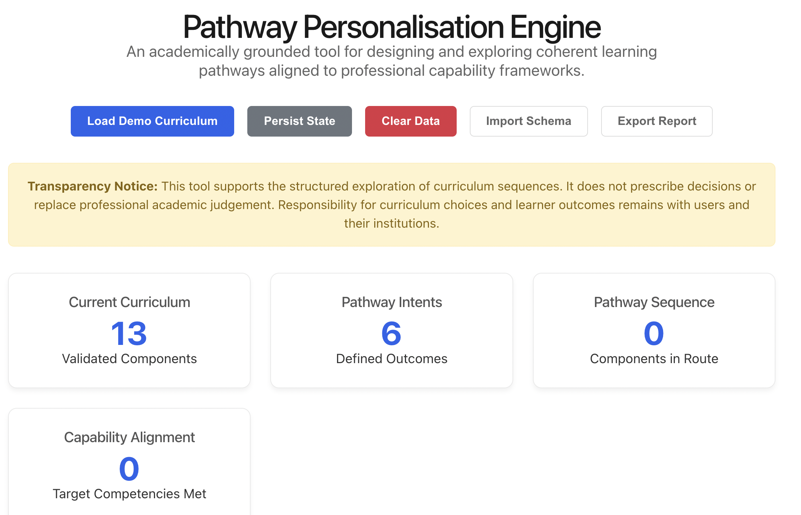

# Pathway Personalisation Engine

An academically grounded tool for designing and exploring coherent learning pathways aligned to professional capability frameworks in healthcare and public health.

---

## 🧐 Overview

The **Pathway Personalisation Engine** facilitates the structured exploration of curriculum sequences. It assists programme teams and academic leads in evaluating how different module combinations align with specific "Pathway Intents" and target professional capabilities through a transparent, governance-ready framework.

🌐 **Live Hosted Version**
[http://cloudpedagogy-pathway-personalisation-engine.s3-website.eu-west-2.amazonaws.com/](http://cloudpedagogy-pathway-personalisation-engine.s3-website.eu-west-2.amazonaws.com/)

---

## 🖼️ Screenshot

---

## 📖 Instructions

For detailed setup, usage, and customization guides, please refer to the:
[Detailed Instructions Document](INSTRUCTIONS.md)

---

## ✨ Key Features

- **Strategic Pathway Intents**: Define target professional outcomes (e.g., *Epidemiological Research*, *Health Policy*).
- **Automated Aligned Sequencing**: Rule-based generation of focused, guided, and comprehensive pathways.
- **Structural Evaluation**: Side-by-side comparison of curriculum breadth, depth, and coherence.
- **Capability Mapping**: Identifies alignment gaps and categorical concentration across target competency frameworks.
- **Governance-Ready Design**: Explicit transparency panels, system assumptions, and reflective checklists for human-in-the-loop oversight.
- **Methodology Transparency**: Explicit pedagogical logic and governance disclaimers for academic oversight.

---

## 🛠️ Technical Stack

- **Core**: React, TypeScript, Vite
- **Styling**: Vanilla CSS (High-performance, Custom Design System)
- **Persistence**: Local browser storage (No external data transmission)
- **Logic**: Deterministic rule-based alignment engine

---

## 🛡️ Disclaimer
This repository contains exploratory, framework-aligned tools developed for reflection, learning, and discussion.

These tools are provided as-is and are not production systems, audits, or compliance instruments. Outputs are indicative only and should be interpreted in context using professional judgement.

All applications are designed to run locally in the browser. No user data is collected, stored, or transmitted.

All example data and structures are synthetic and do not represent any real institution, programme, or curriculum.

---

## 📜 Licensing & Scope
This repository contains open-source software released under the **MIT License**.

CloudPedagogy frameworks and related materials are licensed separately and are not embedded or enforced within this software.

---

## ☁️ About CloudPedagogy
CloudPedagogy develops open, governance-credible resources for building confident, responsible AI capability across education, research, and public service.

- **Website**: [https://www.cloudpedagogy.com/](https://www.cloudpedagogy.com/)
- **Framework**: [CloudPedagogy AI Capability Framework](https://github.com/cloudpedagogy/cloudpedagogy-ai-capability-framework)
